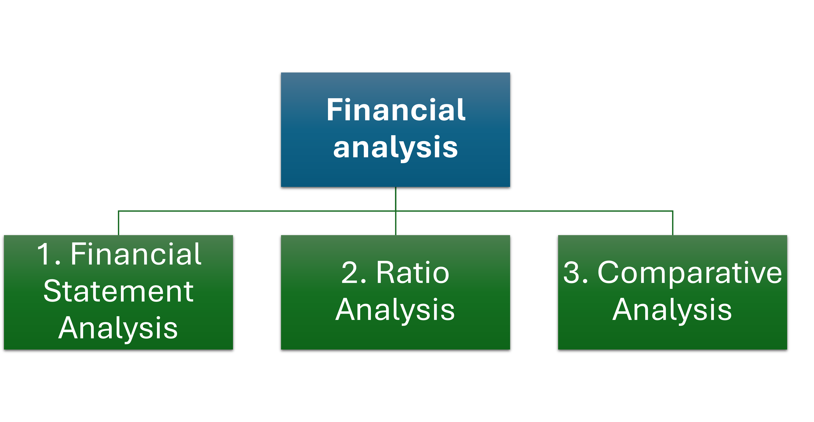

## What is financial analysis?

If the "Why" establishes the purpose, the "What" defines the machinery.

**Financial Analysis** is the systematic process of evaluating businesses, projects, budgets, and other finance-related entities to determine their performance, value, and suitability.

At its simplest, it is a diagnostic framework. Think of a company as a patient. The financial statements (Income Statement, Balance Sheet, Cash Flow Statement) are the patient's medical charts, filled with raw data like heart rate, blood pressure, and lab results. A financial analyst is the doctor who:

1. **Collects the data** _(the financial statements)_
2. **Processes it using various tools and techniques** _(ratios, trends, benchmarks)_
3. **Interprets the results to make a diagnosis** _(Is the company healthy? Is it growing? Is it at risk?)_
4. **Prescribes a course of action or makes a recommendation** _(Invest, Lend, Improve operations)_

### Components

1. **Financial Statement Analysis**

    This is the foundation. It involves a deep dive into the three primary statements:
    - **Income Statement Analysis:** Focuses on profitability
    - **Balance Sheet Analysis:** Focuses on financial position at a point in time
    - **Cash Flow Statement Analysis:** Focuses on liquidity and viability

2. **Ratio Analysis**

    This is the toolkit that transforms raw numbers into comparable, meaningful metrics. By creating relationships between different line items from the financial statements, ratios allow for powerful insights.

3. **Comparative Analysis**

    Numbers in isolation have limited meaning. Their true power is unlocked through comparison:
    - **Trend Analysis:** Comparing the company's performance against its own past. Is it improving, deteriorating, or stable?
    - **Benchmarking:** Comparing the company's ratios and metrics against its main competitors or industry averages. How does it stack up in the marketplace?
