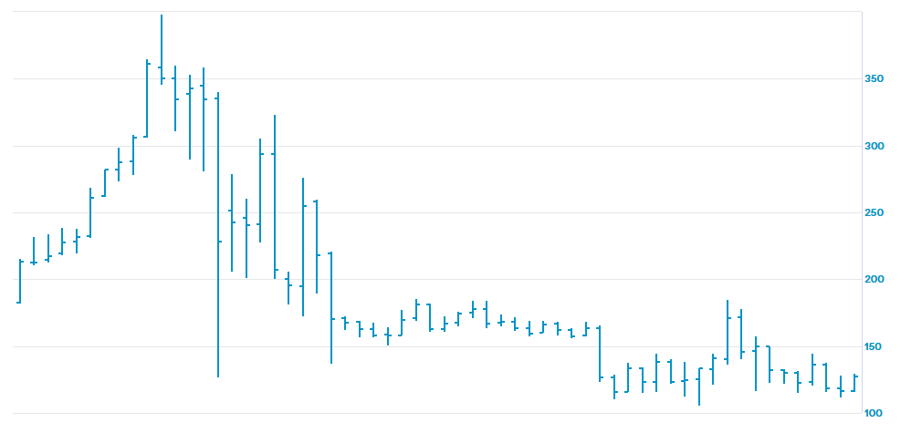

## Why to use financial analysis?

Well, answer to this is pretty simple. Prudent financier not only judges company by market price fluctuations and news, but also by it's key performance indicators.
Financial analysis helps to calculate them and identify the most important ones.

A company’s financial statements - the **Income Statement**, **Balance Sheet**, and **Cash Flow Statement** - are often seen as a complex maze of numbers. To the untrained eye, they can be intimidating and opaque. But for those equipped with financial analysis, these documents transform into a powerful narrative. They tell the story of a company's past decisions, its present health, and its future potential. While we can not predict future in all 100% cases, those who are familiar with financial analysis have more chances to get the forecast right.

### Making decision

Financial analysis mostly helps you to make a decision. It provides a factual foundation instead of just guesses. What does it enable?

- **For investors:** Should you buy, hold, or sell a stock? Financial analysis helps you answer this by assessing a company's profitability, growth potential, and risk. It helps you determine if a company is undervalued or overvalued, and whether it has a sustainable competitive advantage.
- **For Lenders and Creditors:** Is this company a good credit risk? Can it repay a loan? Analysis of liquidity and solvency ratios provides the confidence _(or caution)_ needed to extend credit.
- **For Management:** How can we improve performance? Should we launch a new product, expand into a new market, or acquire a competitor? Internal financial analysis pinpoints strengths to leverage and weaknesses to address, guiding strategic planning and operational efficiency.

### Vital signs

There are a lot of ratios and metrics to check company's vital signs:

- **Profitability:** Is the company generating sufficient profits from its operations? _(e.g., Net Profit Margin, Return on Equity)_.
- **Liquidity:** Can it meet its short-term obligations without stress? _(e.g., Current Ratio, Quick Ratio)_.
- **Solvency:** Is the company financially stable in the long term, or is it overburdened with debt? _(e.g., Debt-to-Equity Ratio)_.
- **Efficiency:** How well is it using its assets to generate revenue? _(e.g., Inventory Turnover, Accounts Receivable Days)_.

### Trends and predicting future

These very metrics and ratios are very important to determine whether the company does wrong or right. We can use them to uncover trends and predict future if we use data from multiple years. We could answer these questions using the data:

- Is **revenue growth** _accelerating or slowing down_?
- Are **profit margins** _expanding or contracting_?
- Is the company's **debt level** _becoming riskier_?

_Does this graph tell you anything?_

_Or this?_

It tells you that currently the second one is on the rise, while the first one is in it's lower point. But nothing more than that. Financial analysis helps you to predict future prices of the company's stock. While we understand that no forecast can be absolutely right and sometimes our forecasts fail, but it would be silly not to use this advantage.

### To compare performance

Is a $10 million profit good? It depends. For a small local business, it's fantastic. For a multinational giant, it might be a failure. Financial analysis creates a level playing field for comparison.

- **Against Competitors (Benchmarking):** How does this company stack up against its industry peers? This reveals its competitive position and operational effectiveness.
- **Against Industry Averages:** Is the company performing above or below industry norms?
- **Against Itself Over Time:** How does this quarter's performance compare to the same quarter last year?

## In brief

We use financial analysis to:

- **Diagnose** past and present performance
- **Understand** the underlying drivers of value and risk
- **Predict** future outcomes with greater confidence
- **Prescribe** actionable strategies for improvement
